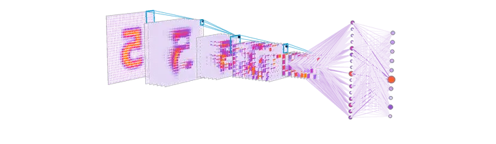
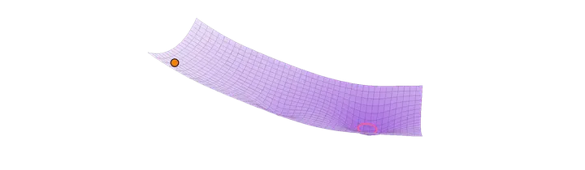

<table width="100%">
<tr>
<td width="70%" align="center" valign="middle">
  <picture>
    <source media="(prefers-color-scheme: dark)" srcset="assets/banner-dark.svg">
    <source media="(prefers-color-scheme: light)" srcset="assets/banner-light.svg">
    
  </picture>
</td>
<td width="30%" align="center" valign="middle">
  <picture>
    <source media="(prefers-color-scheme: dark)" srcset="assets/cnn-3d-dark.webp">
    <source media="(prefers-color-scheme: light)" srcset="assets/cnn-3d-light.webp">
    
  </picture>
   
  <picture>
    <source media="(prefers-color-scheme: dark)" srcset="assets/loss-landscape-dark.webp">
    <source media="(prefers-color-scheme: light)" srcset="assets/loss-landscape-light.webp">
    
  </picture>
</td>
</tr>
</table>

 

## 🧬 Sobre mim

Profissional de dados e IA, unindo **pesquisa em Machine Learning/Deep Learning** com atuação prática em **Inteligência Comercial no Grupo Mateus**. Trabalho o ciclo de ML de ponta a ponta: engenharia de atributos e estruturação de datasets, treino e validação de modelos supervisionados e não supervisionados (Scikit-Learn/PyTorch), até colocar a solução em uso. Uso estatística e pipelines de dados (SQL/ETL) para transformar dado bruto em decisão.

Bacharelado Interdisciplinar em Ciência e Tecnologia, **UFMA** (previsão 2028) 
Objetivo de carreira: **Engenheiro de IA**
 

## 💼 Experiência

**1. Grupo Mateus** · Inteligência Comercial / Marketing Analytics
- **Agentes de IA** que analisam encartes de concorrentes, estruturando produtos e ofertas para a inteligência de mercado
- **Plataforma web de análises** construída de ponta a ponta, onde o Power BI não atendia: coleta e automação dos dados, tratamento, visualização e controle de acesso restrito a colaboradores
- **Bot de verificação de links** que reduziu uma tarefa de semanas para minutos ([CheckWhats](https://github.com/AkyLast/CheckWhats) é a versão pública)
- Dashboards em Power BI para acompanhamento de indicadores da área

 

**2. VisionLab, Laboratório de Visão Computacional (UFMA)** · Pesquisador de Deep Learning & Visão Computacional · jun/2025 – fev/2026
- Implementação de arquiteturas de Deep Learning para reconhecimento de padrões em imagens
- Pré-processamento com OpenCV e Scikit-Image: filtros, transformações e normalização
- Treino e validação de redes neurais, com data augmentation e técnicas para melhorar a generalização e reduzir overfitting
- Estudo e aplicação de técnicas do estado da arte nos projetos do laboratório

 

**3. EDECONSIL** · Auxiliar Administrativo, com atuação em Dados e Automação · abr/2025 – jun/2025
- Responsável pelo ciclo completo dos dados da empresa, da coleta à apresentação de resultados à diretoria e às lideranças, apoiando a tomada de decisão
- Extração e modelagem de dados com SQL, consolidando fontes dispersas em uma base única para relatórios gerenciais
- Tratamento e padronização de dados em Python (Pandas/NumPy), com rotinas de ETL que garantiram a qualidade das informações
- Automação de processos e dashboards de KPIs no Power BI, eliminando horas de trabalho manual recorrente

 

## 🧠 Visão Computacional & Pesquisa

<table>
<tr>
<td width="50%" valign="top">

### Detecção de Focos de Incêndio
Sistema de visão computacional para detectar focos de incêndio em vídeo, com abordagem **data-centric**: pipeline de pré-processamento em OpenCV e curadoria de exemplos de "cauda longa" (cenários raros) para aumentar a robustez e reduzir falsos positivos.

`OpenCV` `Deep Learning` `Data-Centric AI`

[→ ver projeto](https://github.com/AkyLast/Deep-Vision-Hub/tree/main/detection-fire)

</td>
<td width="50%" valign="top">

### Smart Parking Vision
Detecção de ocupação de vagas de estacionamento a partir de vídeo, usando ROIs (regiões de interesse) conectadas a uma API REST.

`OpenCV` `REST API` `Visão Computacional`

[→ ver projeto](https://github.com/AkyLast/Deep-Vision-Hub/tree/main/smart-parking-vision)

</td>
</tr>
<tr>
<td width="50%" valign="top">

### Vision People Counting
Contagem de pessoas em vídeo com processamento de imagem, pensado para fluxo de pessoas em tempo real.

`OpenCV` `Processamento de Imagem`

[→ ver projeto](https://github.com/AkyLast/Deep-Vision-Hub/tree/main/vision-people-counting)

</td>
<td width="50%" valign="top">

### Fenotipagem Computacional da Dengue
Pesquisa acadêmica (UFMA): tratamento de dados do SINAN e clusterização com K-Means para segmentar pacientes em grupos de risco. A análise revelou clusters de **"risco silencioso"**: poucos sintomas, mas alta mortalidade.

`Python` `Scikit-Learn` `Matplotlib` `Estatística`

*Pesquisa acadêmica, repositório em preparação*

</td>
</tr>
</table>

 

## 🧰 Ferramentas & Automação

<table>
<tr>
<td width="50%" valign="top">

### CheckWhats
Versão pública do bot de verificação de links que uso no Grupo Mateus. Verificador automatizado e concorrente de links de convite do WhatsApp (grupos/comunidades) direto de planilhas Excel. Checagem 100% anônima (sem login, sem API oficial), com rotação de proxies gratuitos para contornar bloqueios e 100% de cobertura de testes na lógica central.

`Python` `Docker` `pytest` `Automação`

[→ ver projeto](https://github.com/AkyLast/CheckWhats)

</td>
<td width="50%" valign="top">

### Ubuntu Clipboard
Gerenciador de área de transferência para Linux (GNOME/Wayland), criado pra contornar os vazamentos de memória do histórico nativo do GNOME. Roda como daemon independente com comunicação via IPC (padrão single-instance) e privacidade híbrida: histórico volátil em RAM, favoritos persistidos em SQLite.

`Python` `PyQt5` `IPC` `SQLite`

[→ ver projeto](https://github.com/AkyLast/ubuntu-clipboard)

</td>
</tr>
</table>

Primeiros projetos (onde tudo começou)

 

- **[FlappyBird-AI](https://github.com/AkyLast/FlappyBird-AI)**: Flappy Bird jogado por uma IA treinada com NEAT (Pygame)
- **[Snake](https://github.com/AkyLast/Snake)**: o clássico jogo da cobrinha em HTML, CSS e JavaScript

 

## 🛠️ Stack

| **Linguagens & Backend** | **Dados & Engenharia** | **IA & Visão Computacional** | **Automação & Ferramentas** |
| :---: | :---: | :---: | :---: |
|     |     |       |    |

 

## 📫 Contato

