  <picture>
    <source media="(prefers-color-scheme: dark)" srcset="assets/banner-dark.svg">
    <source media="(prefers-color-scheme: light)" srcset="assets/banner-light.svg">
    
  </picture>

 

## 🧬 Sobre mim

Sou estudante de Ciência e Tecnologia na **UFMA** estudante de **Deep Learning & Visão Computacional**. Gosto de pensar em dados como matéria-prima: transformo o que é bruto e bagunçado em pipelines confiáveis e, em seguida, em modelos que enxergam padrões, literalmente, no caso de visão computacional.

Minha curiosidade nasce da junção de três coisas: **dados**, **matemática** e **imaginação**. Não me interessa só treinar um modelo, quero entender o problema, garantir que os dados contam a verdade, e só então deixar a IA fazer a mágica.

- 🔭 Fui pesquisado de visão computacional aplicada a limpeza de dados, abumentation, treinamento de modelos no VisionLab/UFMA
- ⚙️ Construo pipelines ETL e dashboards
- 💬 Pergunte-me sobre: Data Quality, OpenCV, YOLO, K-Means, Power BI, IA

 

## 🧠 O que eu construo

<table>
<tr>
<td width="50%" valign="top">

### 🔥 Detecção de Fogos de Incêndio
Sistema de visão computacional para detectar automaticamente focos de incêndio em vídeo. Curadoria de exemplos de "cauda longa" (cenários raros) para reduzir falsos positivos, qualidade do dado acima do modelo.

`OpenCV` `Deep Learning` `Data-Centric AI`

[→ ver projeto](https://github.com/AkyLast/Deep-Vision-Hub/tree/main/detection-fire)

</td>
<td width="50%" valign="top">

### 🅿️ Smart Parking Vision
Detecção de ocupação de vagas de estacionamento a partir de vídeo, usando ROIs (regiões de interesse) conectadas a uma API REST.

`OpenCV` `REST API` `Visão Computacional`

[→ ver projeto](https://github.com/AkyLast/Deep-Vision-Hub/tree/main/smart-parking-vision)

</td>
</tr>
<tr>
<td width="50%" valign="top">

### 👥 Vision People Counting
Contagem de pessoas em vídeo com processamento de imagem, pensado para fluxo de pessoas em tempo real.

`OpenCV` `Processamento de Imagem`

[→ ver projeto](https://github.com/AkyLast/Deep-Vision-Hub/tree/main/vision-people-counting)

</td>
<td width="50%" valign="top">

### 🦟 Fenotipagem Computacional da Dengue
Pesquisa acadêmica: limpeza e normalização de dados do SINAN, com clusterização (K-Means) para identificar perfis de "risco silencioso" em saúde pública.

`Python` `Scikit-Learn` `Estatística`

*Pesquisa acadêmica — repositório em preparação*

</td>
</tr>
</table>

🎮 Primeiros projetos (onde tudo começou)

 

- **[FlappyBird-AI](https://github.com/AkyLast/FlappyBird-AI)** — Flappy Bird jogado por uma IA treinada com NEAT (Pygame)
- **[Snake](https://github.com/AkyLast/Snake)** — o clássico jogo da cobrinha em HTML, CSS e JavaScript

 

## 🛠️ Stack

| **Linguagens & Backend** | **Dados & Engenharia** | **IA & Visão Computacional** |
| :---: | :---: | :---: |
|     |    |     |
 

## 📫 Contato

